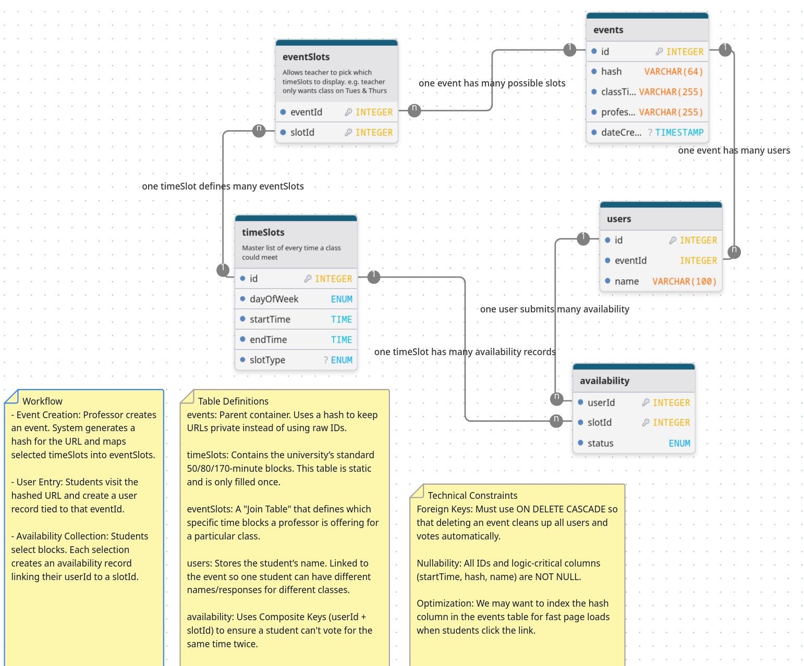

# Principles of Software Design
## Running with Docker

You can spin up the entire project (Database, Backend, and Frontend) using Docker Compose.

### Prerequisites
- [Docker](https://docs.docker.com/get-docker/)
- [Docker Compose](https://docs.docker.com/compose/install/)

### Steps
1. **Clone the repository** (if you haven't already):
   ```bash
   git clone https://github.com/MatthewKaminskiRWU/Principles-of-Software-Design---Team-5
   cd Principles-of-Software-Design---Team-5
   ```

2. **Run Docker Compose**:
   ```bash
   docker compose up --build
   ```

3. **Access the application**:
   - First find the IP of your network.
   - **Main Application**: `http://<YOUR-IP>:3000` (e.g., `http://10.50.1.20:3000`)
   - **Backend API**: `http://<YOUR-IP>:3000/api/` (Proxied internally)

By using the Docker setup, the application is automatically configured to work on the school's WAN. There is no need to hardcode IP addresses; simply share your computer's IP address with students and teachers, and they can access the scheduler on port 3000.

## Documentation
We have compiled detailed reports that provide and overview of the project, as well as instructions for developers.

- [Report](report.pdf) 
- [Development Instructions](overview.pdf)

<details>
  <summary>Database Schema</summary>

  

<p align="center">
  <a href="https://www.drawdb.app/editor?shareId=9a9cf9c3fe9ec6f7aa50fd5b8e62f81f">
    <code>View diagram source</code>
  </a>
</p>

</details>
